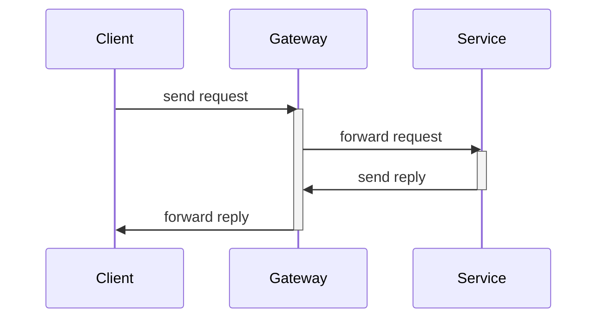
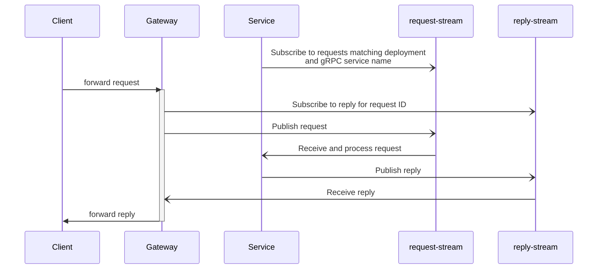
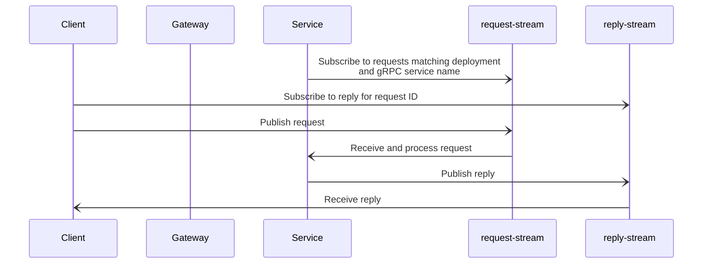
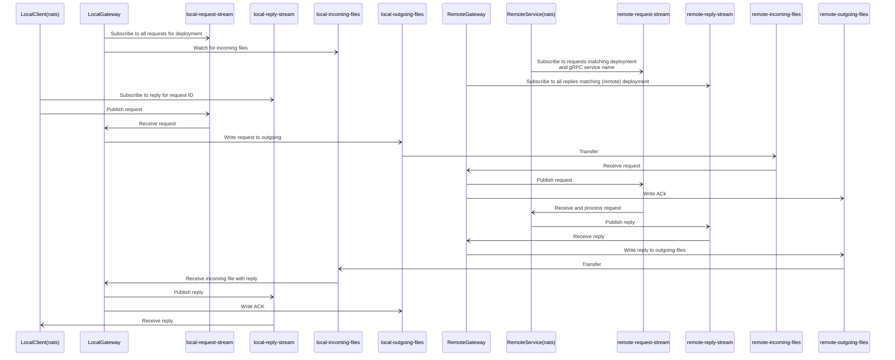

# Intersite communication

Communication between devices that must happen through files, does not provide a convinient abstraction for most client and servers. To facilitate easier Request-Reply when implementing a client or a server, this service/module offers to acts as a Gateway between gRPC client and servers using HTTP2 or nats.io (Jetstream) as a tranport and with sync of nats streams through files.

Why gRPC? To have a schema and Request-Reply definition
Why nats (Jetstream)? To have persistence and optimistic concurrency. To allow client and services to not always be available.

## Local request-reply with gRPC client (HTTP2 transport ) and service (HTTP2 transport)



## Local request-reply with gRPC client (HTTP2) and service (nats)



## Local request-reply with gRPC client (nats) and service (nats)



## Local to remote request-reply with local gRPC client (nats) and remote service (nats)



When transferring files between local and remote an ACK (acknowledge) is written back to signal that the file was received. If an ACK is not received within a predefined time limit or a "NAK (not acknowledge) is transferred, the file is sent again. There should be an upper limit to the number of pending ACKs".

## Serialization

| Format    | Pros                              | Cons                                             |
| --------- | --------------------------------- | ------------------------------------------------ |
| protobuf  | compact                           | not human readable. Requires schema to interpret |
|           | easy to make backwards compatible |                                                  |
| protojson | not compact                       | human readable                                   |
|           |                                   | not so easy to be backwards compatible           |

## Mapping from gRPC service to subject

### Request-reply

Given a gRPC service a RPC could be mapped to the following subject schema:

```
<deployment>.<gRPC service name>.<RPC name>.request.<request ID>
```

The reply should be published to:

```
<deployment>.<gRPC service name>.<RPC name>.reply.<request ID>
```

The reply should have a header specifying the schema, wchi would be the RPC response type or error.

Requests may be discarded (with nothing published to the reply subject), by publishing to a dead-letter-queue. This could be because some headers are invalid, the request could not be delivered or has expired (before any reply was received).

The limitations of the above subject hierachy is that only 1 service is responsible pr deployment.

### Request and reply stream

Given a gRPC service a RPC could be mapped to the following subject schema:

```
<deployment>.<gRPC service name>.<RPC name>.request_stream.<request ID>
```

The reply should be published to:

```
<deployment>.<gRPC service name>.<RPC name>.reply_stream.<request ID>.<sequence>
```

The `sequence` must be an increasing number, greater than 0, gaps are allowed. To signal that the stream is closed, an empty message with the `sequence` set to `EOF` should be published. The message may also contain an error message to signal that the reply stream ended with some error.

The remote gateway must remember the source sequence that already has been acknowledged (or it must be able to query the receiving gateway). Otherwise all the replies must be sent again after a restart.

The reply may also be aborted if a matching `requestID` is published to the dlq.

The gateways must ensure that the remote reply stream is published in the same order to the local reply stream. If this is not possible, the stream should be aborted. Then the client can issue a new request.

### Headers

| Name                             | Description                                                                                     | Example value                                                 | Required                                               |
| -------------------------------- | ----------------------------------------------------------------------------------------------- | ------------------------------------------------------------- | ------------------------------------------------------ |
| gateway-request-created-at       | When the request was created, formatted as RFC3339                                              | 2006-01-02T15:04:05Z07:00                                     | no, but recommended for both the request and the reply |
| gateway-request-expires-at       | After which time the request may discarded/ignored. RFC3339                                     | 2006-01-02T15:04:05Z07:00                                     | required for requests                                  |
| gateway-message-content-type     | Name of the encoding used                                                                       | application/protobuf, application/protojson, application/json | yes                                                    |
| gateway-previous-source-sequence | Used for reply stream. The source sequence of the previous reply. Set to 0 for the first reply. | 123                                                           | Required for stream                                    |
| gateway-source-sequence          | Used for reply stream.                                                                          | 124                                                           | Required for stream                                    |

## Retention

Requests and replices should be expired in nats. This is configured pr stream. The expiration should match durations used for gateway-request-expires-at, e.g. set the stream retention to expire in double the duration used for gateway-request-expires-at.

## One-way sync of nats Jetstream streams

Another use-case is to have a nats Jetstream replicated between `deployments`. This could be built upon the "request and reply stream", then mapped on the receiving site to the required subject pattern.
